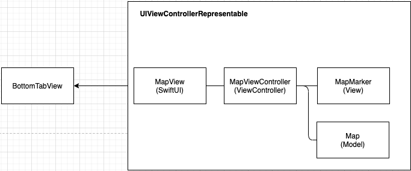

# Application Architecture

## Blueprint

mSNS의 iOS Application 은 기본적으로 아래와 같은 구조로 만들도록 한다.

**MVVM 채택 시**

**MVC 채택 시**

되도록이면 SwiftUI와 MVVM을 사용할 것이며, 그 외 MVC를 써야하는 상황이 올때는 UIViewControllerRepresentable 이나 UIHostingController 를 사용하도록 한다.

MVC를 사용할 때는 각 ViewController에 Coordinator를 만들어서 필요한 데이터를 가공하는 용도로 사용하고 ViewController에서 사용하도록한다.

**또한 ViewController는 UIViewControllerRepresentable를 사용하여 SwiftUI의 View로 변환시켜서 표출하도록 한다.**

## 현재 구조

