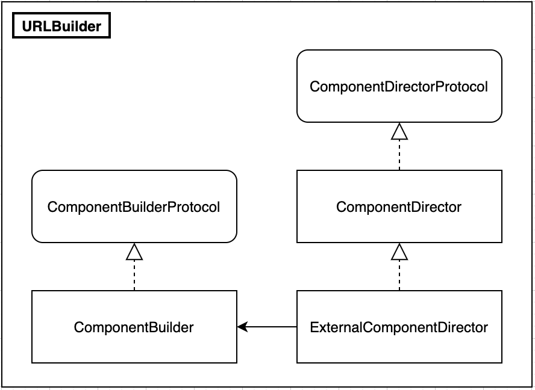

# mSNS-iOS Document

## Communication

서버와의 통신을 위해 HTTP 프로토콜을 사용한다.

외부 라이브러리는 사용하지 않고 기본 내장되어 있는 URLSession 을 사용하도록 한다.

HTTP 통신을 위해 mSNS-iOS에서 어떠한 메서드와 오브젝트가 있는지 살펴보도록 한다.


`CommponetBuilder` 와` ExternalComponentDirector` 인스턴스를 생성한다.

각각의 역할을 살펴 보도록 한다.

### URL Builder

우선 URL Build에 쓰이는 인스턴스들의 관계를 살펴보도록 하겠다.



#### Builder

`CommponentBuilder` 는 `ComponentBuilderProtocol` 를 채택하고 있으며 실제로 url을 가지고 있는 class이다.

* `build()` : `URLComponents`를 이용해 최종적으로 url을 build한다.

#### Director

>  아래의 Dicrector들은 생성할 때 파라미터로 `ComponentBuilderProtocol `타입의 인자를 받는다.
> `ComponentBuilder`의 `builder` 메서드를 사용하기 위함이다.

`ComponentDirector` 는 `ComponentDirectorProtocol` 를 채택하고 있으며 url의 요소들을 정의해주는 class이다.

* `setPath(path:)` :  path의 맨앞에 "/"가 없다면 "/"를 추가해준다. `ComponentBuilder`의 component.path에 path를 넣어주고 return 한다.

* `addQueryItem(name:value:)` : url에 access token을 담아야 할 경우 해당 메서드를 이용한다. 형태는 hash의 key, value와 비슷하게 동작한다.

  동작 메커니즘을 설명하자면 `setPath(path:)` 메서드에서 미리 적용된 path가 있다면, name 인자에서 받은 값({}제외하고) 이 path에 존재하는지 찾아본다. 그리고 그자리에는 key값이 들어가는 동작을 수행하고 `ComponentBuilder`의 component.queryItems에 key, value쌍을 넣어주고 return 한다.

  ```swift
  // ....
  .setPath("/item/token/{google_token}")
  .addQueryItem(name: "{google_token}", key: "asdfsadfgsvzxcvzxQWEFSDzxCHEJL")
  
  //...
  ```

  위의 코드를 예를 들면 

  setPath를 이용해 `.../item/token/{google_token}`  까지 완성된 상태이다.
  addQueryItem을 이용해 path의 "{google_token}" 부분을 key값("asdfsadfgsvzxcvzxQWEFSDzxCHEJL") 으로 댗체해 `.../item/token/asdfsadfgsvzxcvzxQWEFSDzxCHEJL` 라는 url을 만든다.

* `build()` : server의 host url을 지정해주고 `ComponentBuilder` 의 `build() `메서드를 리턴한다.


`ExternalComponentDirector` 는 `ComponentDirector` 를 상속받고 있으며 외부url과 관련된 정보를 가지고 있다. Client 입장에서는 가장 먼저 building해야하는 class.

* `setHost(host:)` : 요청하고자 하는 server의 host url을 지정해주고 그 값을 return 한다.
* `build()` :   `ComponentBuilder` 의 `build() `메서드를 리턴한다.


**한가지 분명한 건 위의 class들은 Parameter setting, header setting 이 아닌 모두 url을 building할 때 쓰이는 메서드와 class들이다.**


### Promise

Callback Hell을 막기위해 Response관련해서는 Promise 패턴을 사용하도록 한다.
사용하는 코드는 [여기](https://theswiftdev.com/promises-in-swift-for-beginners/)([GitHub](https://github.com/CoreKit/Promises)) 를 참고 바란다.


### Usage

```swift
func req(){
  let builder = ComponentBuilder()
  let director = ExternalComponentDirector(builder: builder)
	
  // url 빌드
  let url = director
  .setHost(host: "")
  .setPath(path: "")
  .addQueryItem(name: "", value: "")
  .addQueryItem(name: "", value: "")
  .build()

  // 빌드된 url을 이용해 apiClient의 get 메서드를 호출한다.
  // 성공의 경우에는 .onSuccess,
  // 실패의 경우에는 .onFailure
  // 각각의 클로저로 플로우가 흘러간다.
  apiClient.get(url: url)
  .onSuccess{ data in
  	// Do something
  }
  .onFailure { error in
  	print("\(error)")
  }
}
```

