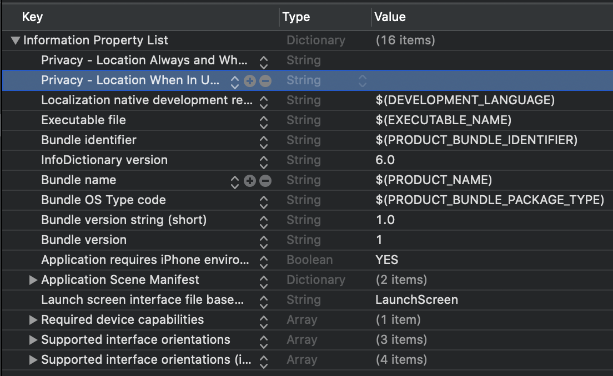
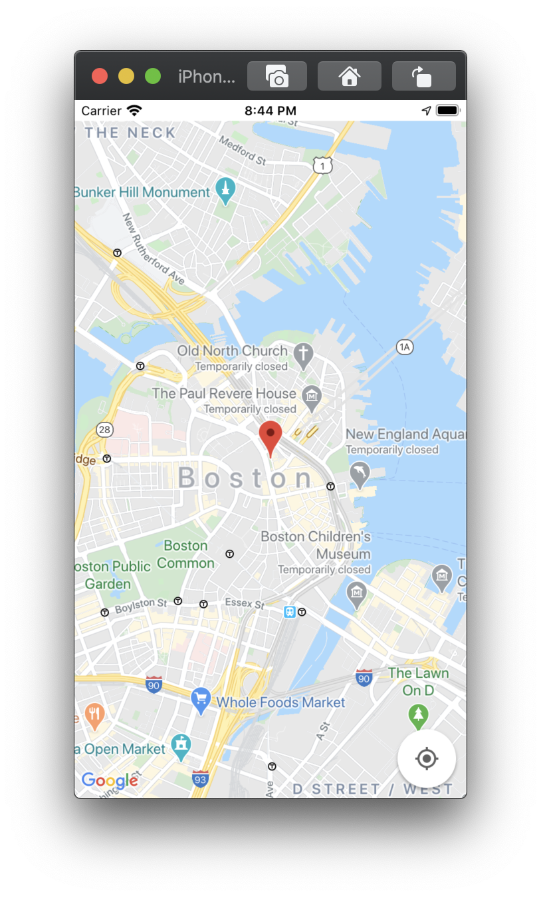

# Map

## Info.plist

우선 Location에 대한 권한을 얻어야 하므로 `Info.plist` 를 수정해주도록 한다.

```xml
...
<key>NSLocationAlwaysAndWhenInUseUsageDescription</key>
	<string></string>
	<key>NSLocationWhenInUseUsageDescription</key>
	<string></string>
...
```



`Privacy - Location When In Use Usage Description` 항목을 추가해주도록 한다.
이는 사용자에게 App을 사용할 때만 위치를 서비스를 사용할 것인지를 물어볼 수 있도록 해준다.
Value값에는 물어 볼 때 문구를 설정해줄 수 있다.

`Privacy - Location Always and When In Use Usage Description` 항목을 추가해주도록 한다.

이는 사용자에게 App을 사용할 때만, 그리고 App을 사용하지 않을 때도 위치 서비스를 사용할 것인지를 물어볼 수 있도록 해준다.

마찬가지로 Value값에는 물어 볼 때 문구를 설정해줄 수 있다.


## Google API before start

우선은 https://developers.google.com/maps/documentation/ios-sdk/start?authuser=1 (2020.04.09기준)의 절차를 따르도록 한다.

Terminal로 프로젝트 폴더로 가서 

<pre>
  pod init
  vim Podfile
</pre>

을 이용해 Podfile을 수정해준다.

```shell
# Uncomment the next line to define a global platform for your project
# platform :ios, '9.0'

target 'GoogleMaps_tutorial' do
  # Comment the next line if you don't want to use dynamic frameworks
  use_frameworks!
		pod 'GoogleMaps'
  	pod 'GooglePlaces'
  # Pods for GoogleMaps_tutorial

end
```

이후 pod을 install 해준다.

`pod install`


pod을 성공적으로 설치했다면 apiKey를 발급받아야 한다. 이 내용은 https://developers.google.com/maps/documentation/ios-sdk/get-api-key?authuser=1#add_key 에 자세히 설명되어있으니 따로 적지는 않겠다.

## Basic Map

우선 AppDelegate에 발급받은 apiKey를 사용하도록 한다.

**AppDelegate.swift**

```swift
import GoogleMaps

@UIApplicationMain
class AppDelegate: UIResponder, UIApplicationDelegate {

    let gmApiKey: String = "yourApiKey"

    func application(_ application: UIApplication, didFinishLaunchingWithOptions launchOptions: [UIApplication.LaunchOptionsKey: Any]?) -> Bool {
        // Override point for customization after application launch.
        GMSServices.provideAPIKey(self.gmApiKey)
        //if using the Places API
//        GMSPlacesClient.provideAPIKey(self.gmApiKey)
        return true
    }
  
  /*
  * ...
  */
}
```


그 후 GoogleMapView.swift 파일을 만들어 다음과 같이 코딩하도록 한다.

**GoogleMapView.swift**

```swift
import SwiftUI
import UIKit
import GoogleMaps

//UIViewRepresentableController: UIViewController를 SwiftUI로 연결
//UIViewRepresentable: UIKit을 SwiftUI로 연결

//ref: https://stackoverflow.com/questions/58350211/how-to-wrap-swiftui-view-into-uiviewcontrollerrepresentable-so-that-google-maps
class GoogleMapController: UIViewController, CLLocationManagerDelegate{
    var locationManager = CLLocationManager()
    var mapView: GMSMapView!
    let defaultLocation = CLLocation(latitude: 42.361145, longitude: -71.057083)
    var zoomLevel: Float = 6.0
    let marker: GMSMarker = GMSMarker()

    override func viewDidLoad() {
        super.viewDidLoad()

        locationManager = CLLocationManager()
        locationManager.desiredAccuracy = kCLLocationAccuracyBest
        locationManager.requestAlwaysAuthorization()
        locationManager.distanceFilter = 50
        locationManager.startUpdatingLocation()
        locationManager.delegate = self

        let camera = GMSCameraPosition.camera(withLatitude: defaultLocation.coordinate.latitude, longitude: defaultLocation.coordinate.longitude, zoom: zoomLevel)
        mapView = GMSMapView.map(withFrame: view.bounds, camera: camera)
        mapView.autoresizingMask = [.flexibleWidth, .flexibleHeight]
        mapView.isMyLocationEnabled = true
        mapView.setMinZoom(14, maxZoom: 20)
        mapView.settings.compassButton = true
        mapView.isMyLocationEnabled = true
        mapView.settings.myLocationButton = true
        mapView.settings.scrollGestures = true
        mapView.settings.zoomGestures = true
        mapView.settings.rotateGestures = true
        mapView.settings.tiltGestures = true
        mapView.isIndoorEnabled = false

        marker.position = CLLocationCoordinate2D(latitude: 42.361145, longitude: -71.057083)
        marker.title = "Boston"
        marker.snippet = "USA"
        marker.map = mapView

        view.addSubview(mapView)
    }

    func locationManager(_ manager: CLLocationManager, didChangeAuthorization status: CLAuthorizationStatus) {
        switch status {
        case .restricted:
          print("Location access was restricted.")
        case .denied:
          print("User denied access to location.")
          // Display the map using the default location.
          mapView.isHidden = false
        case .notDetermined:
          print("Location status not determined.")
        case .authorizedAlways: fallthrough
        case .authorizedWhenInUse:
          print("Location status is OK.")
        }
    }

    func locationManager(_ manager: CLLocationManager, didFailWithError error: Error) {
        locationManager.stopUpdatingLocation()
        print("Error: \(error)")
    }
    
}

struct GoogMapControllerRepresentable: UIViewControllerRepresentable {
    func makeUIViewController(context: UIViewControllerRepresentableContext<GoogMapControllerRepresentable>) -> GoogleMapController {
        return GoogleMapController()
    }

    func updateUIViewController(_ uiViewController: GoogleMapController, context: UIViewControllerRepresentableContext<GoogMapControllerRepresentable>) {

    }
}
```

다른 건 google document나 다른 블로그에 잘 설명 되어있으니 따로 설명을 하지 않겠다.
여기서 중요한건 **ViewController를 어떻게 SwiftUI에서 사용되는 가** 가 주목해야할 점이다.

class안에 struct GoogleMapControllerRepresentable을 선언했는데 이 부분이 해결책이다.
UIViewcontrollerRepresentable에 관한 내용은 [여기](https://zeddios.tistory.com/763)에 잘 설명되어있으니 참고하길 바란다.



## Custom Map Marker

우리가 원하는 Marker는 각 지역마다 가장 인기있는 post의 썸네일과 하트수 등을 표시해주는 마크이다.

따라서 한번에 여러개의 Marker를 생성해줄 필요가 있으며 이를 신경쓰고서 개발을 하도록한다.

우선 GMSMarker를 상속받는 class를 하나 생성하도록 한다.

**MapMarker.swift**

```swift
import Foundation
import UIKit
import GoogleMaps

class MapMarker: GMSMarker{
    let background: UIImage = UIImage(named: "bg_visit")!.withRenderingMode(.alwaysTemplate)
    let heartIcon: UIImage = UIImage(named: "btn_heart_on")!.withRenderingMode(.alwaysTemplate)
    let thumnail: UIImage = UIImage()
    let textView: UITextView = UITextView()
    
    override init(){
        super.init()
        
         // setup marker
        let markerView = UIImageView(image: self.background)
       
        markerView.addSubview(UIImageView(image: self.heartIcon))
        markerView.addSubview(UIImageView(image: self.thumnail))
        markerView.addSubview(textView)
        // marker building
        self.iconView = markerView
    }
}

```

위의 코드는 GMSMarker에 우리의 원하는 모습으로 custom하는 코드이다.

그리고 MapView에서 다음과 같이 표출하도록 한다.

```swift
// ... 

class GoogleMapController: UIViewController, CLLocationManagerDelegate{
  	// ...
    //marker
    let marker: MapMarker = MapMarker() // marker initializer

  	override func viewDidload(){
      	// ...
      	self.createMarker()
    }
  
  	// marker 생성 GCD를 이용해서 여러개 생성하는 부분
  	func createMarker(){
      	self.mapView.selectedMarker = self.marker
    }
}
```

꽤나 여러개의 marker를 표시할 수도있기 때문에 GCD사용을 염두해두고 작성하도록 한다.

UI정리는 나중에 하도록 하고 우선은 구조와 구현만 신경쓰도록 한다.


