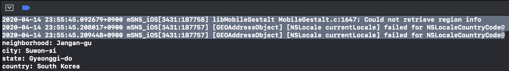

# ReverseCeocoding

iOS에는 CLGeoCoder란는 클래스를 통해 주소를 좌표로, 좌표를 주소로 변경할 수 있는 기능을 제공하고 있다.
[구글에서도 Geocoding을 지원해주는 SDK](https://developers.google.com/maps/documentation/geocoding/start)가 있지만 이는 유료 SDK이고, 사용을 하려면 따로 API key를 받는 등 복잡하고 우리가 원하는 것은 국가, 도, 시, 구 정도의 간단한 데이터만을 원하기 때문에 일단은 `CoreLocation` 에서 지원해주는 기본 method를 사용하려고 한다.

우리가 할 것은 현재 위치(위도, 경도)를 받아 이 GPS좌표를 실제 주소로 변환하는 예제를 진행해보려고 한다.

우선은 Geocoding 을 담당하는 class가 있다.
이 안에는 geocode라는 메소드가 선언되어 있으며 이 메소드가 우리가 하려는 일을 담당한다.
geocode 메소드는 closure를 파라미터로 받고 클로저의 파라미터는 `CLPlacemark` 타입을 받는다. placemark가 실질적으로 우리가 원하는 정보가 담겨 있는 파라미터이다. ([CLPlacemark](https://developer.apple.com/documentation/corelocation/clplacemark))

```swift
import Foundation
import CoreLocation

class Geocoding{
    func geocode(location: CLLocation, completion: @escaping (_ placemark: [CLPlacemark]?, _ error: Error?) -> Void)  {
        CLGeocoder().reverseGeocodeLocation(location) { placemark, error in
            guard let placemark = placemark, error == nil else {
                completion(nil, error)
                return
            }
            completion(placemark, nil)
        }
    }
}

```

**Uage**

```swift
func geocoding(){
        let location = CLLocation(latitude: 37.293418, longitude: 127.011916)
        let geo: Geocoding = Geocoding()
        geo.geocode(location: location) { placemark, error in
            if let error = error as? CLError {
                print("CLError:", error)
                return
            } else if let placemark = placemark?.first {
                // you should always update your UI in the main thread
                DispatchQueue.main.async {
                    //  update UI here
//                    print("name:", placemark.name ?? "unknown")

//                    print("address1:", placemark.thoroughfare ?? "unknown")
//                    print("address2:", placemark.subThoroughfare ?? "unknown")
                    print("neighborhood:", placemark.subLocality ?? "unknown")
                    print("city:", placemark.locality ?? "unknown")

                    print("state:", placemark.administrativeArea ?? "unknown")
//                    print("subAdministrativeArea:", placemark.subAdministrativeArea ?? "unknown")
//                    print("zip code:", placemark.postalCode ?? "unknown")
                    print("country:", placemark.country ?? "unknown", terminator: "\n\n")

//                    print("isoCountryCode:", placemark.isoCountryCode ?? "unknown")
//                    print("region identifier:", placemark.region?.identifier ?? "unknown")
//
//                    print("timezone:", placemark.timeZone ?? "unknown", terminator:"\n\n")

                    // Mailind Address
//                    print(placemark.mailingAddress ?? "unknown")
                }
            }
        }
    }
```

**출력**



주소를 입력했더니 아래 4줄 처럼 깔끔하게 텍스트로 나오는 것을 확인 할 수 있다.

위의 세줄 짜리 에러메세지는 MKMapView delegate를 세팅해주지 않아서 생기는 에러메세지 이다. 우리는 MKMapView를 사용할 필요가 없으므로 무시해줘도 된다.

https://stackoverflow.com/questions/58784483/mapkit-mobilegestalt-c1647-could-not-retrieve-region-info


## Reference

* https://greenchobo.tistory.com/8
* https://stackoverflow.com/questions/46869394/reverse-geocoding-in-swift-4